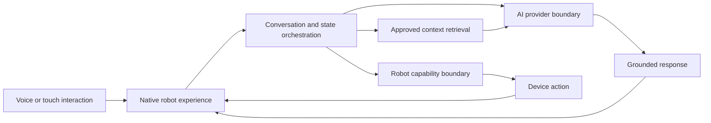

# TEMI Enterprise AI Experience — Sanitized Case Study

> A public, implementation-safe account of my work on an enterprise AI experience for a Temi robot platform. The production repository, organizational knowledge, infrastructure details, credentials, and internal operating data remain private.

## The challenge

The robot platform had useful hardware capabilities but needed a coherent product layer before it could support real enterprise interactions. The work required more than connecting a language model to a chat screen: the experience had to coordinate voice, retrieval, device actions, interface state, backend services, and unreliable real-world conditions.

The immediate goal was to turn a largely underused platform into a demonstrable AI product while establishing an architecture the team could continue to test, operate, and extend.

## My role

I worked across product discovery, architecture, AI integration, backend services, the Android experience, and deployment readiness. My contribution focused on connecting previously separate capabilities into one end-to-end interaction and then removing the integration and runtime problems that appeared under realistic use.

This was a small-team effort. I describe my own contribution here without publishing proprietary source code or claiming sole ownership of work completed with colleagues.

## What I changed

### 1. Separated product behavior from providers

I used provider boundaries for model inference and robot capabilities so the core interaction flow did not depend directly on one model endpoint or one hardware implementation. This allowed local development and managed inference paths to share the same product behavior and made failures easier to isolate.

### 2. Connected the interaction end to end

I worked across the native robot interface and Python service layer to connect conversation state, voice interaction, retrieval-grounded knowledge, AI responses, and device behavior. The result was a single product journey rather than a collection of disconnected demonstrations.

### 3. Stabilized integration and runtime behavior

The most important work happened after the first demo path existed. I traced dependency, state, provider, and contract mismatches across components; repaired the critical paths; and documented repeatable setup and recovery steps so the platform could be restored and validated more consistently.

### 4. Designed for reviewable enterprise use

The design separated retrieval context, model calls, device actions, and UI state. That structure created clearer places for access control, human review, logging, retention decisions, and provider substitution as the system matured.

## High-level architecture

The diagram intentionally omits proprietary service names, network topology, internal data sources, credentials, and device configuration.

## Result

During an intensive two-week iteration, the team transformed the platform into a solution reported publicly as capable of handling nearly **3× the previous load**. The resulting experience was presented to executive leadership and continued into testing, stabilization, and capability development.

The work also produced a more maintainable foundation: clearer provider boundaries, an integrated client/service workflow, repeatable recovery material, and explicit operational follow-up instead of treating the successful demonstration as the finish line.

## What I learned

- A polished AI demonstration can hide weak contracts between state, retrieval, model, and device layers.
- Provider abstraction is valuable when it protects product behavior and testability; abstraction without a concrete failure it solves adds little.
- Retrieval and model quality are only part of a voice product. Turn-taking, cancellation, timeouts, fallback behavior, and visible state determine whether the experience feels trustworthy.
- The fastest route from prototype to product is to measure the failure path, document the recovery path, and keep human judgment at consequential action boundaries.

## Public evidence

- [TEMI milestone and executive showcase](https://www.linkedin.com/feed/update/urn:li:activity:7476265833967538177/)
- [Team iteration and nearly 3× capacity result](https://www.linkedin.com/feed/update/urn:li:activity:7474902333907312640/)

## Disclosure boundary

This case study contains only high-level architecture and facts already suitable for public professional discussion. It does not publish production source code, company knowledge, personal data, internal endpoints, model credentials, network details, security configuration, customer information, or confidential performance reports.

